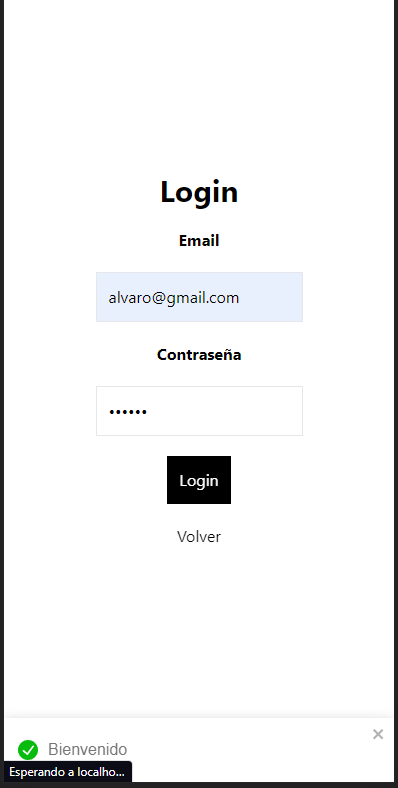
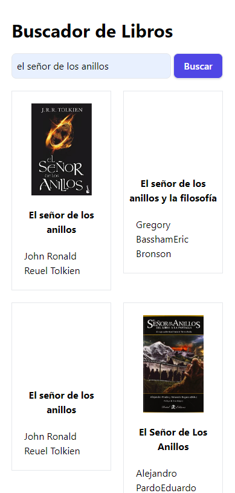
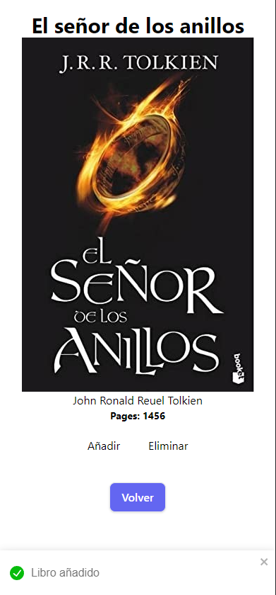

# BookstoreRS - Next.js

## Descripción

Este proyecto es una aplicación web de una biblioteca en línea desarrollada en Next.js. Utiliza Prisma y MongoDB como base de datos para el registro de usuarios, inicio de sesión y almacenamiento de datos.

La aplicación permite a los usuarios registrarse, iniciar sesión y mantener su sesión abierta hasta que decidan cerrarla manualmente. Una vez iniciada la sesión, los usuarios pueden acceder al panel de control donde pueden ver y administrar sus datos.

La aplicación está diseñada para proporcionar una experiencia de biblioteca en línea intuitiva y fácil de usar. Los usuarios pueden registrar sus cuentas, iniciar sesión, buscar libros, guardar los libros que han leído y mantener un registro personalizado de sus actividades de lectura.

(La aplicación no esta acabada)

## Características

1. Registro de usuarios: Los usuarios pueden crear una cuenta proporcionando su nombre, dirección de correo electrónico y una contraseña segura.

2. Inicio de sesión: Los usuarios registrados pueden iniciar sesión utilizando su dirección de correo electrónico y contraseña.

3. Búsqueda de libros: Los usuarios pueden buscar libros en la biblioteca en línea por título, autor u otros criterios relevantes.

4. Guardar libros leídos: Los usuarios pueden guardar los libros que han leído en su lista personal de libros leídos.

## Tecnologías utilizadas

- Next.js: Un framework de desarrollo web de React.js que permite la creación de aplicaciones web rápidas y eficientes.
- Prisma: Una herramienta de base de datos ORM (Mapeo Objeto-Relacional) que simplifica la comunicación y manipulación de la base de datos.
- MongoDB: Una base de datos NoSQL que proporciona un almacenamiento flexible y escalable para los datos de la aplicación.

## Imagenes






## Requisitos previos

Antes de ejecutar la aplicación, asegúrate de tener instalados los siguientes elementos:

- Node.js: [Descargar e instalar Node.js](https://nodejs.org)
- MongoDB: [Descargar e instalar MongoDB](https://www.mongodb.com)

## Instalación

Sigue estos pasos para configurar y ejecutar la aplicación en tu entorno local:

1. Clona el repositorio:

   ```bash
   git clone https://github.com/AlvaroMartinCrespo/bookstore.git
   ```

2. Accede al directorio del proyecto:

   ```bash
   cd nombre-repositorio
   ```

4. Instala las dependencias:

  ```bash
   npm install
   ```

5. Configuración de la base de datos:

   - Crea un archivo .env.local en el directorio raíz del proyecto.
   - Agrega la siguiente línea al archivo .env.local y reemplaza <TU_URL_MONGODB> con la URL de conexión de tu instancia de MongoDB:

    ```bash
   MONGODB_URL=<TU_URL_MONGODB>
   ```

6. Inicia la aplicación

    ```bash
   npm run dev
   ```

# Contribución

Si deseas contribuir a este proyecto, sigue los pasos a continuación:

1. Realiza un fork del repositorio.
2. Crea una rama para tu nueva función o corrección de errores: git checkout -b nombre-rama.
3. Realiza tus modificaciones y correcciones de código.
4. Realiza commit de tus cambios: git commit -m "Descripción de los cambios".
5. Empuja tus cambios a tu repositorio fork: git push origin nombre-rama.
6. Crea un pull request en el repositorio original.

# Licencia
Este proyecto está licenciado bajo la Licencia MIT. Siéntete libre de utilizar, modificar y distribuir este código de acuerdo con los términos de la licencia.

# Contacto
Si tienes alguna pregunta, sugerencia o consulta sobre este proyecto, no dudes en contactarme a través de mi dirección de correo electrónico: alvaro.martin.crespo.00@gmail.com

-Linkedin: [Álvaro Martín Crespo](https://www.linkedin.com/in/%C3%A1lvaro-mart%C3%ADn-crespo-bb9aa5246/)
